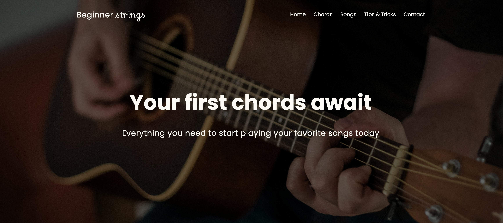

# Welcome to Beginner Strings

1. [View the Live Site 👩‍💻](https://beginner-strings.vercel.app/)
2. [Purpose](#purpose)
3. [Technologies](#technologies)
4. [Key Features](#key-features)

## Purpose

This project has been a fun way for me to practice using SCSS along with the [BEM methodology](https://getbem.com/). Born out of my current experience, the theme of the site is targeted towards beginners learning guitar, and provides some high level resources that can be helpful when you're getting started.

## Technologies

This site is comprised of:

-   SCSS
    -   Including the use of variables mixins and modules to improve efficiency and code maintainability.
    -   Along with the utilisation of the BEM methodology to structure my SCSS code.
-   HTML
    -   For the core page structures throughout the site.
-   Javascript
    -   To inject some interactivity throughout the site.

## Key Features

Some of the key features of this project include:

### Header opacity change on Scroll

I implemented a fixed navbar that stays at the top of the page at all times, and upon initial page load the header nav bar background is transparent. Through the use of Javascript, I added functionality such that when a user begins to scroll down the page, the header background becomes opaque; ensuring that the nav links are clearly visible no matter where the user is on the page.

### Contact Form

To practice making responsive forms, I implemented a contact form where users can enter their name, email, reason for contacting and a message. This form includes validation and upon submission reveals a thank you message to the user to confirm that the contact form has been sent successfully.

### Expandable and Collapsible tips

I made the decision to put the helpful tips on the `tips & tricks` page into expandable / collapsible containers. This helps the user focus on a single piece of information at a time and is more digestible than something like a wall of text. In order to make it clear to the user that the containers can be expanded and collapsed, I ensured the first tip is pre-expanded when first loading the page.

### Embedded iFrame

In order to link a helpful video resource on the `chords` page, I made use of the inbuilt `iframe` tag in HTML along with CSS rules to ensure the aspect-ratio remained the same across all device sizes.

### Fully Responsive

A key consideration in this project was full responsiveness across all screen sizes. I used media queries, flexbox and CSS-grid in order to ensure all elements behaved as exected and remained visually consistent no matter the device width.